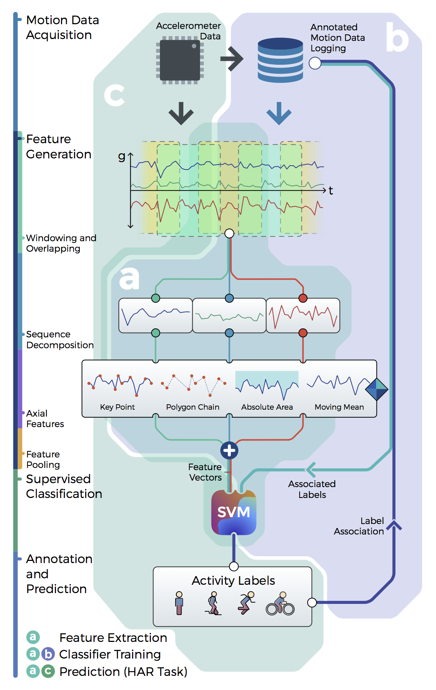

# Human Activing Recognition

## What is it?

This is my school project from 2015 on using accelerometer data for human activity recognition task.

> School Project done at CIC, University of Delhi.
> I will add all the notes/pages/etc I have soon before archiving it.
> Note that this paper was never submitted anywhere, but I plan to put it on arxiv.

## What's in here?

In the repo, there is:

- MPU–9250 fw, in few flavours, eg. SD card data logging.
- Schematics of the arduino data logger
- Python code for training a SVM classifier
- Some pre-built models to classify the accelerometer data
- Raw dataset i created with motion data
- Project report Submitted in school
- Pretty graphs and illustrations
- An iphone app (in xcode!) for streaming accelerometer data over wifi in udp packets
- A python server which takes the streaming data and shows classified predictions in console
- A data logger script to put the streaming data into InfluxDB time series
- Raw dataset obtained from two universities And some 3D point cloud visualisation

Based heavily on MPU-9250 example code by [kriswiner/MPU-9250](https://github.com/kriswiner/MPU-9250).

## Licenses

- **Code License**: MIT
- **Dataset License**: CC0, Public Domain
- **Illustrations License**: CC-BY-SA-NC
- **Report License**: Property of Delhi University
- **Report source License**: CC0
- **Trained Model License**: WTFPL
